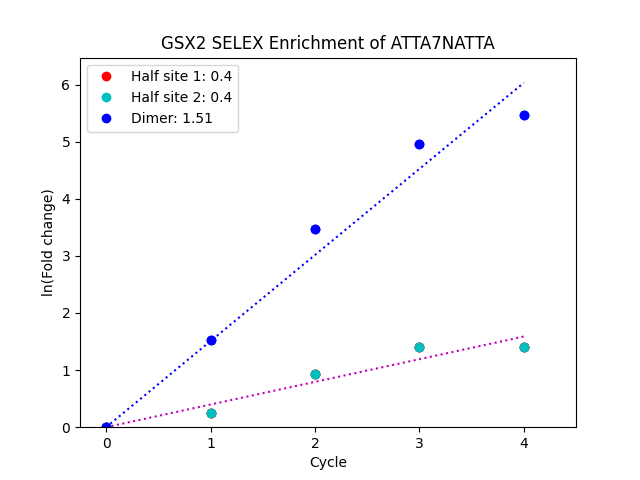
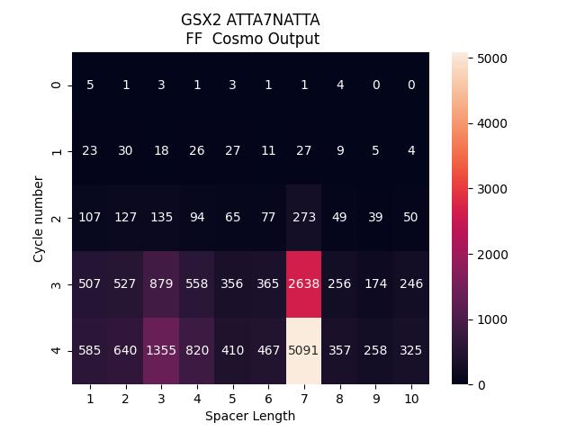

# Predict homeodomain transcription factor cooperativity with HT-SELEX

This program predicts cooperativity of transcription factors using HT-SELEX by both assessing dimer versus individual half-site enrichment as well as spacer preference as done in *Link paper here!*.

We suggest running both the enrichment analysis and COSMO analysis as they test different aspects of cooperativity and require the transcription factor to pass all criteria.

## Prerequisites

*Prerequisite versions that program was tested on are listed. Other versions may be usable.*
1. [HOMER 4.9](http://homer.ucsd.edu/homer/introduction/install.html)
	- Requires below line changes in findKnownMotifs.pl to eliminate divide by zero error. 

| Line number | Original                                                                     | Required new line
|-------------|------------------------------------------------------------------------------|-------------------
| 152         | $totalNumTargets = floor($numTargets/($percentTargets\*0.01)+0.5);           | $totalNumTargets = floor($numTargets/($percentTargets\*0.01+0.0005));
| 153         | $totalNumBackground = floor($numBackground/($percentBackground\*0.01)+0.5);  | $totalNumBackground = floor($numBackground/($percentBackground\*0.01+0.0005));

2. COSMO (will need to link once public)
	- Python 2.7
		- [MOODS (1.0.2.1)](https://www.cs.helsinki.fi/group/pssmfind/)
		- numpy (1.16.6)
		- scipy (1.2.3)
	- We suggest creating a [virtual environment](https://docs.python.org/3/tutorial/venv.html) with these dependencies. 
3. Python (3.7.1)
	- os (base)
	- numpy (1.21.2)
	- glob (base)
	- pandas (1.1.3)
	- re (base)
	- argparse (base)
	- matplotlib (3.3.2)
	- scipy (1.5.3)
	- seaborn (0.11.0)
	- bs4 (4.9.1)
4. R (3.2.0)
	- [readr](https://cran.r-project.org/web/packages/readr/index.html)
	- [outliers](https://cran.r-project.org/web/packages/outliers/index.html)
	- [chisq.posthoc.test](https://cran.r-project.org/web/packages/chisq.posthoc.test/index.html)

## Install

To acquire the repository:

```bash
git clone --recursive https://github.com/cainbn97/SELEX_analysis.git
```

This program is a wrapper around the previously mentioned packages. If you would like to check if these dependencies are functioning, you can run [Dependency_check](`Dependency_check`) to check the installation of python, R, Homer, and COSMO, as well as the required python and R packages. The program expects a COSMO virtual environment given the current deprecated state of the COSMO dependency, MOODs.

```bash
./Dependency_check -k CONFIG.txt
```

A CONFIG file is required to run COSMO to ensure the virtual environment is properly found and sourced. An example of a [CONFIG.txt](`CONFIG.txt`) is included and shown below. COSMO_VENV is the absolute path to the location of the executable bin folder of the virtual environment and COSMO_PATH is the absolute path to the location of the COSMO package/scripts.

```
COSMO_VENV	/venv/bin
COSMO_PATH	/COSMO
```

*This will not install the necessary packages and software. It will only let you know if the packages and software are installed and accessible in your current environment.*

## Usage

User can select to download HT-SELEX data associated with [DNA-Binding Specificities of Human Transcription Factors](http://dx.doi.org/10.1016/j.cell.2012.12.009) for analysis or use their own data. 

This program is not computationally intensive if you are not running a HOMER de novo motif analysis. We suggest four processors and at least 30 gb of RAM if you are running a Homer de novo motif analysis and one processor and 4-8 gb of RAM if not. 

### Downloading HT-SELEX data from Jolma 2013

```bash
./Cooperativity_predictor OPTIONS [ANALYSIS] [DOWNLOAD LINK OF CYCLE1 FILE]
```

For example,
```bash
./Cooperativity_predictor -che -k CONFIG.txt -z ftp.sra.ebi.ac.uk/vol1/run/ERR195/ERR195929/ZeroCycle_TCCAAC20NCG_0_0.fastq.gz GSX2 ftp.sra.ebi.ac.uk/vol1/run/ERR195/ERR195221/GSX2_TCCAAC20NCG_Y_1.fastq.gz
```

The program will automatically determine the download links for the remaining cycles. The initial library download link must be inputted separately.

### Using downloaded or own HT-SELEX data

```bash
./Cooperativity_predictor OPTIONS [ANALYSIS NAME]
```

Program expects the files to be in the following layout:

```
ANALYSIS	
├── Cycle1	
│   └── *.fastq.gz		
├── Cycle2	
│   └── *.fastq.gz	
├── Cycle3	
│   └── *.fastq.gz	
├── Cycle4	
    └── *.fastq.gz
```

### Program run options

```
Default: all analyses run
[-h] HOMER de novo motif analysis and dimer site selection run.
[-e] Enrichment analysis only run, requires a supported PWM.
[-c] COSMO only run, requires a supported PWM.

Additional options:
[-z] Initial library cycle download link for normalization. If no download link or file [-b] provided, program uses cycle 1 library for normalization.
[-b] Enter a fastq.gz file from the initial library of HT-SELEX. If no download link [-z] or file provided, program uses cycle 1 library for normalization.
[-t] Motif threshold for MOODS. Must be a value between 0 and 1. Default is 0.8.
[-p] Enter a motif file if you would like to use a motif generator other than HOMER. This will overwrite -h option.
[-k] Enter a configuation file to find COSMO. THIS IS REQUIRED FOR A COSMO RUN."

```

## Program outputs

### Dimer search

We call the probability weight of the highest probable nucleotide at each position the nucleotide impact. The 2 nonoverlapping 4-mers with the highest average nucleotide impact will be selected as half sites. 4-mers are used in this analysis as the conserved residues in the HD directly mediate contact with the core ‘TAAT’ 4-mer.  If the average nucleotide impact of the two half sites is 1.6 times greater than the nucleotide impacts of the surrounding flanking regions and spacer, and the average nucleotide impact for each of the two half sites is greater than 0.6, then the motif is considered a dimer site.

*These parameters can be adjusted to accomodate other transcription factor families and experimental designs.*

**Analysis outputs**

1. dimer_description_check.txt
	- Gives Site:Non-site and site specific nucleotide impacts for each dimer site
2. top_dimer_kmer_motifs_MOTIFNAME
	- Contains Jaspar formatted PWMs for COSMO analysis
	- *Will only appear if COSMO analysis is selected*
3. long_motif_consensus.txt
	- This is more of an intermediate file. It contains the found dimer sites. 

*User can use their own PWM using the \[-p\] option. This motif must follow the [Homer motif format](http://homer.ucsd.edu/homer/motif/creatingCustomMotifs.html) and be at least 10 nt in length*

*We suggest four processors and at least 30 gb of RAM if you are running a Homer de novo motif analysis.* 

**Output organization**

```
ANALYSIS
├── top_dimer_kmer_motifs_\[motif\]
	└── motif1.jpwm
	└── motif2.jpwm
...
├── Cycle4
	└── homerResults
	└── PWMs
		└── motif1.motif
		...
├── dimer_description_check.txt
├── long_motif_consensus.txt

```

*Program will call a motif a dimer site if nucleotide impact for each site is greater than 0.6 and the site:non-site ratio is greater than 1.6.*


### Enrichment analysis

This analysis will use Homer to count the number of full dimer sites and individual half sites in each of the HT-SELEX cycles. It calculates the fold changes and then transforms the fold changes using a natural log to linearize site enrichment. The enrichment factor for the motif is the ratio of the dimer site slope and the average of the two half site slopes. 

*Any motif with an enrichment factor of greater than 2 is indicative of cooperative behavior.*

**Analysis outputs**

1. Folders containing known motif results for each half site and dimer site at each cycle
2. Analysis_Enrichment_analysis_run_summary.txt
3. ANALYSIS_NatLog_2_Enrichment_plot_MOTIF.txt


**Output organization**

```
ANALYSIS
├── Cycle1
│   └── ANALYSIS_1_dimer1_homer
│	└── ANALYSIS_1_site1_dimer1_homer
│	└── ANALYSIS_1_site2_dimer1_homer
...
├── ANALYSIS_Enrichment_analysis_run_summary.txt
├── ANALYSIS_NatLog_2_Enrichment_plot_\[motif\].txt
```


**Example of enrichment plot**




### COSMO analysis

COSMO will take jPWMs and count the number of dimer sites at each orientation, spacer length, and jPWM combination. This analysis uses COSMO to count the number of dimers at the orientation and motif combination that represents the dimer site PWM at all spacer lengths between 1 and 10. It then uses a chi-square test for independence to compare the number of dimer sites at each spacer length between the initial library and Cycle 4. If a TF binds to the specified dimer site cooperatively, it will select for unique spacer length(s) between the initial library and final SELEX cycle. The program also uses Grubb's test to detect outliers among the dimer counts at Cycle 4. If a TF binds to the specificed dimer site cooperatively, it will select for specific spacer length by Cycle 4. As such, both tests look for spacer specificity in slightly different manners. 

*Any motif with a p-value of <0.05 for the chi-square test for independence and Grubb's test is indicative of cooperative behavior.*

**Analysis outputs**

1. ANALYSIS_COSMO_run_summary_wgrubbs.txt
2. Raw COSMO output and tabbed files separated by motif combination for each cycle and dimer site motif
3. Dimer site counts found by COSMO for each motif combination for each dimer site motif
	- x-axis: spacer length
	- y-axis: cycle number
4. Heatmap illustrating dimer counts across cycles and spacer lengths

*Any motif with a p-value of <0.05 for the chi-square test for independence and Grubb's test is indicative of cooperative behavior.*

**Output organization**

```
ANALYSIS
├── top_dimer_kmer_motifs_dimer1
│   └── ANALYSIS_dimer1_motif1_motif1_FF_cosmo_output.png
│	└── ANALYSIS_dimer1_motif1_motif2_FF_cosmo_output.png
│	└── ANALYSIS_dimer1_motif2_motif1_FF_cosmo_output.png
│	└── ANALYSIS_dimer1_motif2_motif2_FF_cosmo_output.png
│	└── motif1.jpwm
│	└── motif2.jpwm
│	└── ANALYSIS_dimer1_motif1_motif1_FF.txt
│	└── ANALYSIS_dimer1_motif1_motif2_FF.txt
│	└── ANALYSIS_dimer1_motif2_motif1_FF.txt
│	└── ANALYSIS_dimer1_motif2_motif2_FF.txt
├── Cycle1
│   └── ANALYSIS_1_dimer1_COSMO
│		└── cosmo.counts.tab
│		└── Cycle1_motif1_motif1_FF.tab
│		└── Cycle1_motif1_motif2_FF.tab
│		└── Cycle1_motif2_motif1_FF.tab
│		└── Cycle2_motif2_motif1_FF.tab
...
```
	
**Example of COSMO heatmap**




## Authors

| Contributor                       | Institution                 | Remarks
|-----------------------------------|-----------------------------|-------------------------
| [Brittany Cain](mailto:Brittany.Cain@cchmc.org)       | Cincinnati Children's Hosp.   | Pipeline author


## License

MIT. See [`LICENSE.txt`](LICENSE.txt).
